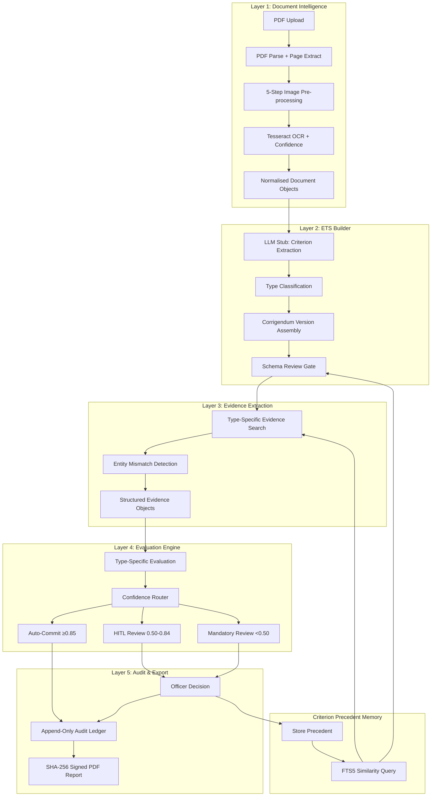
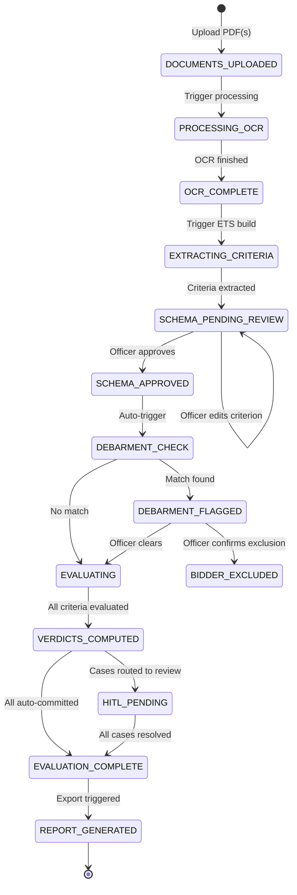
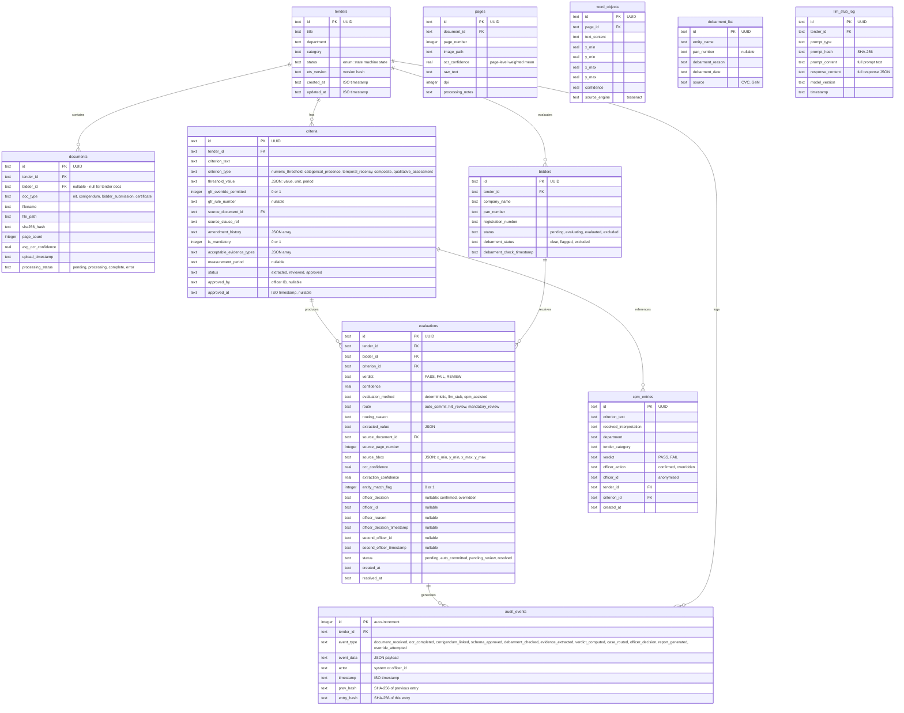

# Design Document — VerdictAI

## Overview

VerdictAI is a self-contained, locally-running Explainable AI Procurement Intelligence Platform that automates government tender eligibility evaluation. The system is structured as a five-layer pipeline where each layer has bounded responsibility and a structured output contract. The prototype uses React + Vite + TailwindCSS for the frontend, Python FastAPI for the backend, and SQLite for all persistence including full-text search via FTS5.

### Key Design Decisions

1. **SQLite over PostgreSQL**: The prototype uses SQLite for zero-setup, single-file deployment. FTS5 replaces pgvector for text similarity search in CPM. This eliminates external database dependencies entirely.
2. **LLM Stub over real LLM**: A local mock service returns pre-configured structured JSON responses, enabling demonstration of all four scenarios without network dependencies.
3. **No blockchain/HSM**: Audit integrity is maintained via append-only SQLite triggers and SHA-256 hash chains. The blockchain anchoring and HSM signing are stubbed for the prototype.
4. **Single-process deployment**: The entire backend runs as a single FastAPI process with SQLite, startable with one command.

### System Boundaries

```
┌─────────────────────────────────────────────────────────────┐
│                    Browser (React + Vite)                     │
└──────────────────────────┬──────────────────────────────────┘
                           │ REST API (JSON)
┌──────────────────────────▼──────────────────────────────────┐
│                   FastAPI Backend                             │
│  ┌─────┐ ┌─────┐ ┌─────┐ ┌─────┐ ┌─────┐ ┌──────────┐    │
│  │ L1  │ │ L2  │ │ L3  │ │ L4  │ │ L5  │ │ LLM Stub │    │
│  └─────┘ └─────┘ └─────┘ └─────┘ └─────┘ └──────────┘    │
└──────────────────────────┬──────────────────────────────────┘
                           │ SQLite (single file)
┌──────────────────────────▼──────────────────────────────────┐
│              verdict_ai.db (SQLite + FTS5)                    │
└─────────────────────────────────────────────────────────────┘
```

## Architecture

### Five-Layer Pipeline



### Data Flow Summary

| Layer | Input | Output | Trigger |
|-------|-------|--------|---------|
| L1 | PDF file (upload) | Normalised document objects (page, bbox, text, confidence) | File upload API call |
| L2 | Document objects + LLM Stub responses | Effective Tender Specification (typed criteria with provenance) | After L1 completes |
| L3 | Approved ETS + Bidder documents | Evidence objects per (bidder, criterion) | After schema approval |
| L4 | Evidence objects | Verdicts with confidence + routing decisions | After L3 completes per bidder |
| L5 | All events from L1-L4 + officer decisions | Immutable audit log + PDF report | Continuous (events) / On-demand (report) |

### State Machine — Evaluation Workflow



### State Transition Rules

| From State | To State | Trigger | Guard Condition |
|------------|----------|---------|-----------------|
| DOCUMENTS_UPLOADED | PROCESSING_OCR | Officer triggers processing | At least one document uploaded |
| PROCESSING_OCR | OCR_COMPLETE | System event | All pages processed |
| OCR_COMPLETE | EXTRACTING_CRITERIA | Auto-trigger | — |
| EXTRACTING_CRITERIA | SCHEMA_PENDING_REVIEW | System event | LLM Stub returns criteria |
| SCHEMA_PENDING_REVIEW | SCHEMA_APPROVED | Officer action | Explicit approval click |
| SCHEMA_APPROVED | DEBARMENT_CHECK | Auto-trigger | — |
| DEBARMENT_CHECK | EVALUATING | System event | No debarment match |
| DEBARMENT_CHECK | DEBARMENT_FLAGGED | System event | Match found |
| EVALUATING | VERDICTS_COMPUTED | System event | All (bidder, criterion) pairs evaluated |
| VERDICTS_COMPUTED | HITL_PENDING | System event | At least one case routed to HITL/Mandatory |
| HITL_PENDING | EVALUATION_COMPLETE | Officer action | All pending cases resolved |
| EVALUATION_COMPLETE | REPORT_GENERATED | Officer action | Export requested |

## Components and Interfaces

### Backend Module Structure

```
backend/
├── main.py                    # FastAPI app entry point
├── config.py                  # Settings, DB path, thresholds
├── database/
│   ├── __init__.py
│   ├── connection.py          # SQLite connection + WAL mode
│   ├── schema.py              # Table creation + triggers
│   └── seed.py                # Demo data seeding
├── models/
│   ├── __init__.py
│   ├── document.py            # Document, Page, WordObject
│   ├── criterion.py           # Criterion, CriterionType enum
│   ├── evidence.py            # Evidence, EntityMatch
│   ├── evaluation.py          # Verdict, Route enum, Confidence
│   ├── audit.py               # AuditEvent
│   └── cpm.py                 # CPMEntry
├── layers/
│   ├── __init__.py
│   ├── l1_document.py         # PDF parse, pre-processing, OCR
│   ├── l2_ets_builder.py      # Criterion extraction, ETS assembly
│   ├── l3_evidence.py         # Evidence extraction per type
│   ├── l4_evaluation.py       # Evaluation engine + confidence router
│   └── l5_audit.py            # Audit ledger + report export
├── services/
│   ├── __init__.py
│   ├── llm_stub.py            # Mock LLM service
│   ├── cpm_service.py         # CPM query + store
│   ├── debarment_service.py   # CVC debarment check
│   └── entity_matcher.py      # Fuzzy name matching
├── api/
│   ├── __init__.py
│   ├── documents.py           # Document upload endpoints
│   ├── tenders.py             # Tender/ETS endpoints
│   ├── evaluation.py          # Evaluation + routing endpoints
│   ├── hitl.py                # HITL review endpoints
│   ├── audit.py               # Audit + report endpoints
│   └── cpm.py                 # CPM query endpoints
└── utils/
    ├── __init__.py
    ├── pdf_utils.py           # PDF parsing helpers
    ├── ocr_utils.py           # Tesseract wrapper
    ├── hash_utils.py          # SHA-256 utilities
    └── image_processing.py    # OpenCV pre-processing pipeline
```

### Frontend Component Hierarchy

```
frontend/src/
├── App.tsx                     # Root + Router
├── main.tsx                    # Vite entry
├── api/
│   └── client.ts              # Axios/fetch wrapper for FastAPI
├── pages/
│   ├── Dashboard.tsx           # Evaluation progress overview
│   ├── TenderUpload.tsx        # Document upload page
│   ├── SchemaReview.tsx        # Criterion schema review + approval
│   ├── EvaluationView.tsx      # Per-bidder evaluation status
│   ├── HITLQueue.tsx           # Review queue listing
│   ├── HITLReviewCard.tsx      # Single-screen 5-component review
│   └── ReportExport.tsx        # Report generation + download
├── components/
│   ├── layout/
│   │   ├── Sidebar.tsx         # Navigation sidebar
│   │   ├── Header.tsx          # Top bar with tender context
│   │   └── PageLayout.tsx      # Common page wrapper
│   ├── documents/
│   │   ├── FileUploader.tsx    # Drag-drop PDF upload
│   │   ├── DocumentList.tsx    # Uploaded documents list
│   │   └── PageViewer.tsx      # PDF page image viewer with bbox overlay
│   ├── criteria/
│   │   ├── CriterionCard.tsx   # Single criterion display
│   │   ├── CriterionList.tsx   # All criteria in ETS
│   │   ├── TypeBadge.tsx       # Criterion type indicator
│   │   ├── GFRBadge.tsx        # GFR override status indicator
│   │   └── CorrigendumDiff.tsx # Side-by-side diff view
│   ├── evaluation/
│   │   ├── VerdictBadge.tsx    # PASS/FAIL/REVIEW indicator
│   │   ├── ConfidenceBar.tsx   # Visual confidence score
│   │   ├── RouteBadge.tsx      # Auto/HITL/Mandatory indicator
│   │   └── BidderSummary.tsx   # Per-bidder evaluation summary
│   ├── hitl/
│   │   ├── EvidencePanel.tsx   # Document image + bbox highlight
│   │   ├── AnalysisPanel.tsx   # System verdict + reasoning
│   │   ├── CPMPanel.tsx        # Precedent context display
│   │   ├── DecisionPanel.tsx   # Confirm/Override controls
│   │   └── OverrideModal.tsx   # Structured reason form
│   └── common/
│       ├── StatusChip.tsx      # Generic status indicator
│       ├── ProgressBar.tsx     # Progress indicator
│       └── EmptyState.tsx      # Empty state placeholder
├── hooks/
│   ├── useTender.ts            # Tender state management
│   ├── useEvaluation.ts        # Evaluation polling/state
│   └── useHITL.ts              # HITL queue management
├── types/
│   └── index.ts                # TypeScript interfaces matching API
└── utils/
    └── formatters.ts           # Date, confidence, currency formatters
```

### Key Interfaces

#### LLM Stub Interface

```python
class LLMStubRequest(BaseModel):
    prompt_type: Literal["criterion_extraction", "qualitative_evaluation", "similarity_assessment"]
    context: dict  # Document text, criterion text, etc.
    tender_id: str
    scenario_hint: Optional[str] = None  # For demo scenario matching

class LLMStubResponse(BaseModel):
    result: dict           # Structured output (criteria list, verdict, etc.)
    confidence: float      # 0.0 - 1.0
    reasoning: str         # Explanation text
    is_simulated: bool     # Always True for stub
    model_version: str     # "llm-stub-v1.0"
    prompt_hash: str       # SHA-256 of input prompt for reproducibility
```

#### Confidence Router Interface

```python
class RoutingDecision(BaseModel):
    route: Literal["auto_commit", "hitl_review", "mandatory_review"]
    confidence: float
    reasons: list[str]           # Human-readable routing reasons
    flags: list[str]             # entity_mismatch, stamp_obscuration, etc.
    gfr_override_permitted: bool
    is_mandatory_criterion: bool

def compute_route(
    verdict: Verdict,
    confidence: float,
    criterion_type: CriterionType,
    flags: list[str],
    is_mandatory: bool,
    gfr_override_permitted: bool,
    cpm_data_count: int          # For conservative threshold adjustment
) -> RoutingDecision: ...
```

#### Entity Matcher Interface

```python
class EntityMatchResult(BaseModel):
    registered_name: str
    extracted_name: str
    similarity_score: float      # 0.0 - 1.0
    is_match: bool               # True if score >= threshold
    mismatch_type: Optional[str] # "parent_company", "abbreviation", "different_entity"
    requires_review: bool        # True if mismatch detected

def match_entity(
    registered_name: str,
    extracted_name: str,
    threshold: float = 0.85
) -> EntityMatchResult: ...
```

## Data Models

### Database Schema (SQLite)



### SQLite FTS5 Virtual Table for CPM

```sql
-- FTS5 virtual table for criterion text similarity search
CREATE VIRTUAL TABLE cpm_fts USING fts5(
    criterion_text,
    resolved_interpretation,
    department,
    tender_category,
    content='cpm_entries',
    content_rowid='rowid'
);

-- Triggers to keep FTS5 in sync with cpm_entries
CREATE TRIGGER cpm_fts_insert AFTER INSERT ON cpm_entries BEGIN
    INSERT INTO cpm_fts(rowid, criterion_text, resolved_interpretation, department, tender_category)
    VALUES (new.rowid, new.criterion_text, new.resolved_interpretation, new.department, new.tender_category);
END;
```

### Audit Ledger Immutability Trigger

```sql
-- Prevent any UPDATE on audit_events
CREATE TRIGGER audit_no_update BEFORE UPDATE ON audit_events
BEGIN
    SELECT RAISE(ABORT, 'UPDATE not permitted on audit_events: append-only ledger');
END;

-- Prevent any DELETE on audit_events
CREATE TRIGGER audit_no_delete BEFORE DELETE ON audit_events
BEGIN
    SELECT RAISE(ABORT, 'DELETE not permitted on audit_events: append-only ledger');
END;
```


## API Design

### Base URL: `http://localhost:8000/api/v1`

### Document Endpoints

| Method | Path | Description | Request | Response |
|--------|------|-------------|---------|----------|
| POST | `/documents/upload` | Upload PDF document | `multipart/form-data: file, tender_id, doc_type, bidder_id?` | `{id, filename, page_count, status}` |
| GET | `/documents/{id}` | Get document metadata | — | `{id, tender_id, doc_type, filename, sha256_hash, page_count, avg_ocr_confidence, status}` |
| GET | `/documents/{id}/pages` | List pages with OCR data | — | `[{page_number, ocr_confidence, image_url, word_count}]` |
| GET | `/documents/{id}/pages/{page_num}/image` | Get page image | — | `image/png` binary |
| GET | `/documents/{id}/pages/{page_num}/words` | Get word objects with bbox | — | `[{text, bbox, confidence}]` |

### Tender Endpoints

| Method | Path | Description | Request | Response |
|--------|------|-------------|---------|----------|
| POST | `/tenders` | Create new tender evaluation | `{title, department, category}` | `{id, title, status, created_at}` |
| GET | `/tenders` | List all tenders | — | `[{id, title, department, status, created_at}]` |
| GET | `/tenders/{id}` | Get tender details + state | — | `{id, title, department, category, status, ets_version, documents, bidders}` |
| POST | `/tenders/{id}/process` | Trigger OCR + criterion extraction | — | `{status: "processing", job_id}` |
| GET | `/tenders/{id}/status` | Poll processing status | — | `{status, progress_pct, current_step}` |

### ETS / Schema Review Endpoints

| Method | Path | Description | Request | Response |
|--------|------|-------------|---------|----------|
| GET | `/tenders/{id}/criteria` | Get extracted criteria | — | `[{id, text, type, threshold, gfr_override_permitted, status, amendment_history}]` |
| PUT | `/tenders/{id}/criteria/{cid}` | Edit criterion during review | `{criterion_text?, threshold_value?, type?}` | `{id, ...updated fields}` |
| GET | `/tenders/{id}/criteria/{cid}/diff` | Get corrigendum diff | — | `{original, amended, corrigendum_id, amendment_date}` |
| POST | `/tenders/{id}/schema/approve` | Approve schema (gate) | `{officer_id}` | `{status: "approved", approved_at}` |
| GET | `/tenders/{id}/criteria/{cid}/cpm` | Get CPM precedents for criterion | — | `[{interpretation, department, tender_id, date, frequency}]` |

### Evaluation Endpoints

| Method | Path | Description | Request | Response |
|--------|------|-------------|---------|----------|
| POST | `/tenders/{id}/evaluate` | Trigger evaluation for all bidders | — | `{status: "evaluating", bidder_count}` |
| GET | `/tenders/{id}/evaluations` | Get all evaluations | `?bidder_id&status&route` | `[{id, bidder, criterion, verdict, confidence, route, status}]` |
| GET | `/evaluations/{id}` | Get single evaluation detail | — | `{full evaluation object with evidence, bbox, reasoning}` |
| GET | `/tenders/{id}/summary` | Get evaluation summary stats | — | `{total, auto_committed, pending_review, completed, by_bidder: [...]}` |

### Debarment Endpoints

| Method | Path | Description | Request | Response |
|--------|------|-------------|---------|----------|
| POST | `/tenders/{id}/debarment-check` | Run debarment check for all bidders | — | `{checked: N, flagged: [...], clear: [...]}` |
| GET | `/bidders/{id}/debarment` | Get debarment status for bidder | — | `{status, matched_entity?, match_details?}` |

### HITL Review Endpoints

| Method | Path | Description | Request | Response |
|--------|------|-------------|---------|----------|
| GET | `/tenders/{id}/hitl/queue` | Get pending HITL cases | `?route=hitl_review|mandatory_review` | `[{evaluation_id, bidder, criterion, confidence, route, reason}]` |
| GET | `/hitl/{evaluation_id}/card` | Get full HITL review card data | — | `{criterion, evidence, analysis, cpm_precedents, decision_options}` |
| POST | `/hitl/{evaluation_id}/decide` | Submit officer decision | `{decision: "confirm"|"override", officer_id, reason?, reason_text?}` | `{status: "resolved", audit_event_id}` |
| POST | `/hitl/{evaluation_id}/second-officer` | Submit second-officer confirmation | `{officer_id, decision: "approve"|"reject"}` | `{status, audit_event_id}` |

### CPM Endpoints

| Method | Path | Description | Request | Response |
|--------|------|-------------|---------|----------|
| GET | `/cpm/search` | Search CPM precedents | `?query&department&category&limit=3` | `[{criterion_text, interpretation, verdict, tender_id, date}]` |
| GET | `/cpm/stats` | Get CPM data statistics | — | `{total_entries, by_department, by_category, calibration_ready}` |

### Audit & Report Endpoints

| Method | Path | Description | Request | Response |
|--------|------|-------------|---------|----------|
| GET | `/tenders/{id}/audit` | Get audit trail | `?event_type&from&to` | `[{id, event_type, actor, timestamp, data_summary}]` |
| POST | `/tenders/{id}/report` | Generate evaluation report PDF | `{officer_id}` | `{report_id, download_url, sha256_hash}` |
| GET | `/reports/{id}/download` | Download generated PDF | — | `application/pdf` binary |
| POST | `/tenders/{id}/reproduce` | Trigger reproduction verification | `{report_id}` | `{match: bool, differences?: [...]}` |

### Error Response Format

```json
{
  "error": {
    "code": "SCHEMA_NOT_APPROVED",
    "message": "Cannot start evaluation: criterion schema has not been approved by an officer",
    "details": {
      "tender_id": "...",
      "current_status": "SCHEMA_PENDING_REVIEW"
    }
  }
}
```

### HTTP Status Codes

| Code | Usage |
|------|-------|
| 200 | Successful GET/PUT |
| 201 | Successful POST (resource created) |
| 400 | Invalid input (validation error) |
| 404 | Resource not found |
| 409 | State conflict (e.g., evaluating before schema approval) |
| 422 | Unprocessable entity (valid JSON but semantic error) |
| 500 | Internal server error |

## Key Algorithms

### 1. Confidence Routing Logic

The confidence router determines the disposition of each (bidder, criterion) evaluation:

```python
def compute_route(
    verdict: str,
    confidence: float,
    criterion_type: str,
    flags: list[str],
    is_mandatory: bool,
    gfr_override_permitted: bool,
    cpm_data_count: int
) -> RoutingDecision:
    """
    Routing priority (highest to lowest):
    1. Mandatory FAIL → always mandatory_review
    2. Explicit flags (entity_mismatch, debarment) → mandatory_review
    3. Low confidence (<0.50) → mandatory_review
    4. LLM FAIL verdict → hitl_review (never auto-commit LLM disqualification)
    5. Medium confidence (0.50-0.84) → hitl_review
    6. High confidence (≥0.85) + deterministic + no flags → auto_commit
    
    Conservative mode (cpm_data_count < 50):
    - Auto-commit ceiling raised to 0.90
    - Mandatory review floor raised to 0.60
    """
    # Determine thresholds based on CPM data availability
    auto_commit_threshold = 0.90 if cpm_data_count < 50 else 0.85
    mandatory_floor = 0.60 if cpm_data_count < 50 else 0.50

    reasons = []

    # Rule 1: Mandatory criterion FAIL → always mandatory review
    if is_mandatory and verdict == "FAIL":
        reasons.append("Mandatory criterion FAIL requires officer confirmation")
        return RoutingDecision(
            route="mandatory_review", confidence=confidence,
            reasons=reasons, flags=flags,
            gfr_override_permitted=gfr_override_permitted,
            is_mandatory_criterion=is_mandatory
        )

    # Rule 2: Explicit flags → mandatory review
    if flags:
        reasons.append(f"Flags present: {', '.join(flags)}")
        return RoutingDecision(route="mandatory_review", ...)

    # Rule 3: Low confidence → mandatory review
    if confidence < mandatory_floor:
        reasons.append(f"Confidence {confidence:.2f} below mandatory floor {mandatory_floor}")
        return RoutingDecision(route="mandatory_review", ...)

    # Rule 4: LLM FAIL → never auto-commit
    if criterion_type == "qualitative_assessment" and verdict == "FAIL":
        reasons.append("LLM-based FAIL verdict requires officer review")
        return RoutingDecision(route="hitl_review", ...)

    # Rule 5: Medium confidence → HITL review
    if confidence < auto_commit_threshold:
        reasons.append(f"Confidence {confidence:.2f} below auto-commit threshold {auto_commit_threshold}")
        return RoutingDecision(route="hitl_review", ...)

    # Rule 6: High confidence, deterministic, no flags → auto-commit
    if criterion_type in ("numeric_threshold", "categorical_presence", "temporal_recency"):
        reasons.append("High confidence deterministic evaluation")
        return RoutingDecision(route="auto_commit", ...)

    # Default: HITL for qualitative even at high confidence PASS
    reasons.append("Qualitative assessment requires review")
    return RoutingDecision(route="hitl_review", ...)
```

### 2. Entity Matching Algorithm

```python
import re
from difflib import SequenceMatcher

# Common abbreviation expansions for Indian companies
ABBREVIATIONS = {
    "pvt": "private", "ltd": "limited", "co": "company",
    "corp": "corporation", "engg": "engineering", "infra": "infrastructure",
    "const": "construction", "tech": "technologies", "govt": "government",
}

def normalise_company_name(name: str) -> str:
    """Normalise for comparison: lowercase, expand abbreviations, remove punctuation."""
    name = name.lower().strip()
    name = re.sub(r'[.,\-()&]', ' ', name)
    tokens = name.split()
    tokens = [ABBREVIATIONS.get(t, t) for t in tokens]
    # Remove common suffixes that don't affect identity
    remove_suffixes = {"private", "limited", "pvt", "ltd", "india"}
    tokens = [t for t in tokens if t not in remove_suffixes]
    return " ".join(tokens)

def match_entity(registered_name: str, extracted_name: str, threshold: float = 0.85) -> EntityMatchResult:
    """
    Fuzzy match with abbreviation expansion.
    Returns match result with mismatch classification.
    """
    norm_registered = normalise_company_name(registered_name)
    norm_extracted = normalise_company_name(extracted_name)

    # Exact match after normalisation
    if norm_registered == norm_extracted:
        return EntityMatchResult(
            registered_name=registered_name, extracted_name=extracted_name,
            similarity_score=1.0, is_match=True, requires_review=False
        )

    # Sequence similarity
    score = SequenceMatcher(None, norm_registered, norm_extracted).ratio()

    # Containment check (parent company detection)
    is_substring = norm_registered in norm_extracted or norm_extracted in norm_registered
    mismatch_type = None
    if not is_substring and score < threshold:
        mismatch_type = "different_entity"
    elif is_substring and score < threshold:
        mismatch_type = "parent_company"

    return EntityMatchResult(
        registered_name=registered_name, extracted_name=extracted_name,
        similarity_score=score, is_match=(score >= threshold),
        mismatch_type=mismatch_type,
        requires_review=(score < threshold)
    )
```

### 3. CPM Similarity Search (FTS5)

```python
def search_cpm_precedents(
    criterion_text: str,
    department: str,
    category: str,
    limit: int = 3
) -> list[CPMEntry]:
    """
    Search CPM using SQLite FTS5 with BM25 ranking.
    Filters by department and category for relevance.
    """
    # Tokenise and create FTS5 query
    # Remove stop words and create OR-joined query for fuzzy matching
    tokens = tokenise_for_search(criterion_text)
    fts_query = " OR ".join(tokens)

    sql = """
        SELECT cpm_entries.*, bm25(cpm_fts) as rank
        FROM cpm_fts
        JOIN cpm_entries ON cpm_entries.rowid = cpm_fts.rowid
        WHERE cpm_fts MATCH ?
          AND cpm_entries.department = ?
          AND cpm_entries.tender_category = ?
        ORDER BY rank
        LIMIT ?
    """
    results = db.execute(sql, (fts_query, department, category, limit))
    return [CPMEntry(**row) for row in results]

def tokenise_for_search(text: str) -> list[str]:
    """Remove stop words and short tokens for FTS5 query."""
    stop_words = {"the", "a", "an", "of", "in", "for", "and", "or", "to", "is", "shall", "must"}
    tokens = re.findall(r'\w+', text.lower())
    return [t for t in tokens if t not in stop_words and len(t) > 2]
```

### 4. SHA-256 Hash Chain for Audit Integrity

```python
import hashlib
import json

def compute_entry_hash(event_type: str, event_data: dict, actor: str, timestamp: str, prev_hash: str) -> str:
    """Compute SHA-256 hash linking this entry to the chain."""
    payload = json.dumps({
        "event_type": event_type,
        "event_data": event_data,
        "actor": actor,
        "timestamp": timestamp,
        "prev_hash": prev_hash
    }, sort_keys=True, separators=(',', ':'))
    return hashlib.sha256(payload.encode('utf-8')).hexdigest()

def append_audit_event(tender_id: str, event_type: str, event_data: dict, actor: str) -> AuditEvent:
    """Append event to audit ledger with hash chain."""
    timestamp = datetime.utcnow().isoformat() + "Z"
    
    # Get previous hash (or genesis hash for first entry)
    prev = db.execute(
        "SELECT entry_hash FROM audit_events WHERE tender_id = ? ORDER BY id DESC LIMIT 1",
        (tender_id,)
    ).fetchone()
    prev_hash = prev["entry_hash"] if prev else "0" * 64  # Genesis

    entry_hash = compute_entry_hash(event_type, event_data, actor, timestamp, prev_hash)

    db.execute(
        "INSERT INTO audit_events (tender_id, event_type, event_data, actor, timestamp, prev_hash, entry_hash) VALUES (?, ?, ?, ?, ?, ?, ?)",
        (tender_id, event_type, json.dumps(event_data), actor, timestamp, prev_hash, entry_hash)
    )
    return AuditEvent(...)
```

## LLM Stub Design

### Purpose

The LLM Stub is a local mock service that simulates LLM responses for two primary functions:
1. **Criterion extraction** from tender documents (L2)
2. **Qualitative evaluation** of bidder evidence against criteria (L4)

### Interface

```python
class LLMStub:
    """
    Local mock LLM service. Returns pre-configured responses for demo scenarios
    and default responses for unrecognised prompts.
    """
    MODEL_VERSION = "llm-stub-v1.0"

    def __init__(self):
        self.scenarios = self._load_demo_scenarios()

    def invoke(self, request: LLMStubRequest) -> LLMStubResponse:
        """Main entry point. Matches scenario or returns default."""
        prompt_hash = hashlib.sha256(
            json.dumps(request.dict(), sort_keys=True).encode()
        ).hexdigest()

        # Try to match a pre-configured demo scenario
        matched = self._match_scenario(request)
        if matched:
            return LLMStubResponse(
                result=matched["result"],
                confidence=matched["confidence"],
                reasoning=matched["reasoning"],
                is_simulated=True,
                model_version=self.MODEL_VERSION,
                prompt_hash=prompt_hash
            )

        # Default response for unmatched prompts
        return self._default_response(request, prompt_hash)
```

### Pre-Configured Demo Scenarios

| Scenario | Prompt Type | Response |
|----------|-------------|----------|
| **Criterion extraction with corrigendum** | `criterion_extraction` | Returns 5 criteria with types, thresholds, GFR flags. One criterion shows amendment from corrigendum. |
| **Stamp-obscured certificate** | `qualitative_evaluation` | Returns extracted value "7.2 crore" with confidence 0.41, reasoning: "turnover figure partially obscured by rubber stamp" |
| **Entity mismatch** | `qualitative_evaluation` | Returns REVIEW verdict, flags entity mismatch between "ABC Infrastructure Pvt Ltd" (registered) and "ABC Group Holdings Ltd" (extracted) |
| **CPM precedent injection** | `similarity_assessment` | Returns similarity score 0.78 for "RCC box culvert construction" vs "canal crossing structure", with reasoning about structural similarity |

### Default Response Strategy

```python
def _default_response(self, request: LLMStubRequest, prompt_hash: str) -> LLMStubResponse:
    """Return safe default for unrecognised prompts."""
    if request.prompt_type == "criterion_extraction":
        return LLMStubResponse(
            result={"criteria": [], "extraction_notes": "No criteria matched in stub"},
            confidence=0.5,
            reasoning="Default stub response - no matching scenario configured",
            is_simulated=True,
            model_version=self.MODEL_VERSION,
            prompt_hash=prompt_hash
        )
    elif request.prompt_type == "qualitative_evaluation":
        return LLMStubResponse(
            result={"verdict": "REVIEW", "factors": []},
            confidence=0.5,
            reasoning="Default stub response - routing to officer review",
            is_simulated=True,
            model_version=self.MODEL_VERSION,
            prompt_hash=prompt_hash
        )
    # ... similar for other prompt types
```

### Logging for Reproducibility

Every LLM Stub invocation is logged to `llm_stub_log` table with:
- Full prompt content (for reproduction)
- Full response content
- Prompt SHA-256 hash (for matching)
- Model version identifier
- Timestamp

This ensures any evaluation can be reproduced by replaying the same prompts against the same stub version.

## Correctness Properties

*A property is a characteristic or behavior that should hold true across all valid executions of a system — essentially, a formal statement about what the system should do. Properties serve as the bridge between human-readable specifications and machine-verifiable correctness guarantees.*

### Property 1: Mandatory FAIL always routes to mandatory review

*For any* criterion marked as mandatory and *for any* confidence value in [0.0, 1.0], when the verdict is FAIL, the Confidence Router SHALL assign the Mandatory_Review_Route. No mandatory-criterion FAIL is ever auto-committed.

**Validates: Requirements 7.9, 9.1, 9.2**

### Property 2: LLM FAIL verdict never auto-commits

*For any* qualitative_assessment criterion and *for any* confidence value in [0.0, 1.0], when the LLM Stub produces a FAIL verdict, the Confidence Router SHALL NOT assign the Auto_Commit_Route. The route must be hitl_review or mandatory_review.

**Validates: Requirements 7.5, 9.3**

### Property 3: Confidence thresholds determine routing for unflagged deterministic criteria

*For any* evaluation of a deterministic criterion (numeric_threshold, categorical_presence, temporal_recency) with no flags and a non-mandatory PASS verdict:
- If confidence ≥ auto_commit_threshold → route is auto_commit
- If confidence ∈ [mandatory_floor, auto_commit_threshold) → route is hitl_review
- If confidence < mandatory_floor → route is mandatory_review

**Validates: Requirements 7.1, 7.6, 7.7, 7.8**

### Property 4: Flags force mandatory review regardless of confidence

*For any* evaluation with one or more flags present (entity_mismatch, stamp_obscuration, debarment), regardless of confidence score, the Confidence Router SHALL assign the Mandatory_Review_Route.

**Validates: Requirements 6.6, 7.8**

### Property 5: Conservative thresholds when CPM data is insufficient

*For any* routing decision where cpm_data_count < 50, the auto-commit threshold SHALL be 0.90 (not 0.85) and the mandatory review floor SHALL be 0.60 (not 0.50). Evaluations with confidence in [0.85, 0.90) that would normally auto-commit SHALL instead route to hitl_review.

**Validates: Requirements 11.5**

### Property 6: GFR override prevention

*For any* criterion where GFR_override_permitted is false and the verdict is FAIL, the system SHALL reject any officer override attempt. The override action is structurally impossible for GFR-mandatory FAILs.

**Validates: Requirements 8.6, 10.2**

### Property 7: Entity matcher detects mismatches symmetrically

*For any* pair of company names (registered, extracted), if the normalised similarity score is below the threshold (0.85), the Entity Matcher SHALL flag the mismatch and set requires_review to true. The normalisation (abbreviation expansion, suffix removal, punctuation stripping) SHALL be deterministic — normalise(normalise(x)) == normalise(x).

**Validates: Requirements 6.6**

### Property 8: Audit hash chain integrity

*For any* sequence of N audit events for a tender, each event[i] (where i > 0) SHALL have prev_hash equal to event[i-1].entry_hash. The entry_hash SHALL be the SHA-256 of the deterministic serialisation of (event_type, event_data, actor, timestamp, prev_hash). Recomputing any entry_hash from its fields SHALL produce the stored value.

**Validates: Requirements 12.4**

### Property 9: Audit ledger immutability

*For any* existing audit event record, any attempt to UPDATE or DELETE the record SHALL raise an exception and leave the record unchanged. The audit table only grows; it never shrinks or mutates.

**Validates: Requirements 12.2, 12.5**

### Property 10: Schema review gate enforcement

*For any* tender in a state other than SCHEMA_APPROVED (or later), any attempt to trigger bidder evaluation SHALL be rejected. The state machine SHALL enforce that evaluation is unreachable without explicit officer schema approval.

**Validates: Requirements 4.1**

### Property 11: Debarment check precedes evaluation

*For any* bidder in a tender, the debarment check event timestamp in the audit log SHALL precede any evidence extraction or verdict computation event for that bidder. Evaluation cannot begin without a completed debarment check.

**Validates: Requirements 5.1, 5.2**

### Property 12: Corrigendum amendments preserve history

*For any* criterion amended by one or more corrigenda, the amendment_history array SHALL contain both the original value and all intermediate amended values in chronological order. The final threshold_value SHALL equal the most recent amendment. The length of amendment_history SHALL equal the number of corrigenda that modified this criterion plus one (the original).

**Validates: Requirements 3.5**

### Property 13: CPM search results bounded and filtered

*For any* CPM similarity search, the result set SHALL contain at most 3 entries, and every returned entry SHALL match the requested department and tender_category exactly.

**Validates: Requirements 4.5, 8.4, 11.3, 11.4**

### Property 14: OCR page confidence is length-weighted mean

*For any* page with N words where word[i] has text length len[i] and confidence conf[i], the page-level OCR confidence SHALL equal sum(len[i] * conf[i]) / sum(len[i]). The result SHALL always be in [0.0, 1.0].

**Validates: Requirements 2.2**

### Property 15: Evaluation reproducibility (round-trip)

*For any* completed evaluation, re-running the evaluation pipeline with the stored inputs (original documents, ETS at evaluation time, LLM Stub prompts/responses, officer decisions) SHALL produce output identical to the original evaluation record, excluding timestamp fields.

**Validates: Requirements 18.2**

### Property 16: LLM Stub response structure invariant

*For any* valid LLMStubRequest, the LLM Stub SHALL return a response containing: result (dict), confidence (float in [0.0, 1.0]), reasoning (non-empty string), is_simulated (always True), model_version (non-empty string), and prompt_hash (64-character hex string equal to SHA-256 of the serialised request).

**Validates: Requirements 14.1, 14.2, 14.5**

### Property 17: Override requires structured reason

*For any* officer override submission, if the reason field is empty or missing, the system SHALL reject the submission with a validation error. No override is recorded without a structured reason.

**Validates: Requirements 8.5**

## Error Handling

### Error Categories

| Category | HTTP Code | Example | Recovery |
|----------|-----------|---------|----------|
| **Validation Error** | 400 | Missing required field, invalid file type | Return field-level error details; client corrects and retries |
| **State Conflict** | 409 | Evaluating before schema approval, deciding on resolved case | Return current state and required state; client navigates to correct step |
| **Resource Not Found** | 404 | Invalid tender_id, evaluation_id | Return resource type and ID; client refreshes |
| **Processing Error** | 500 | OCR failure, PDF parse error | Log to audit, mark document as "error" status, return error details |
| **Integrity Violation** | 500 | Hash chain break, audit trigger violation | Log violation attempt, reject operation, alert |

### Layer-Specific Error Handling

#### L1 — Document Intelligence
- **Corrupted PDF**: Return `{error: "DOCUMENT_UNREADABLE", details: {reason, page_number?}}`. Mark document status as "error". Log to audit.
- **OCR below threshold**: Flag page as degraded (confidence < 0.50). Do NOT fail — propagate low confidence to downstream routing.
- **Pre-processing failure**: Log specific step that failed. Return partial results for pages that succeeded.

#### L2 — ETS Builder
- **Missing corrigendum**: Detect amendment indicators ("as amended", "refer addendum") without corresponding file. Block evaluation with `{error: "MISSING_CORRIGENDUM", details: {indicator_text, clause_ref}}`.
- **Ambiguous extraction**: Flag criterion with status "needs_review". Do NOT block — surface to officer during schema review.
- **LLM Stub error**: Return default empty extraction with confidence 0.0. Log the failure.

#### L3 — Evidence Extraction
- **No evidence found**: Return extraction result with null value and confidence 0.0. Route to mandatory_review.
- **Multiple conflicting values**: Flag ambiguity, include all candidates in extraction result, route to HITL.
- **Entity mismatch**: Flag but do NOT fail. Include both names in result. Route to mandatory_review.

#### L4 — Evaluation Engine
- **Invalid criterion type**: Reject with 422. This indicates a schema error that should have been caught at L2.
- **Missing evidence**: Cannot evaluate — route to mandatory_review with reason "evidence_not_found".
- **Confidence computation error**: Default to 0.0 confidence (most conservative). Route to mandatory_review.

#### L5 — Audit Ledger
- **Hash chain break detected**: Log violation as a critical event. Return error to caller. Do NOT proceed with the operation that caused the break.
- **UPDATE/DELETE attempt**: SQLite trigger raises exception. Caught by application layer and logged as `override_attempted` event type.
- **PDF generation failure**: Return error with partial data. Audit events are already recorded regardless of report generation success.

### Global Error Response Format

All API errors follow a consistent structure:

```json
{
  "error": {
    "code": "ERROR_CODE_CONSTANT",
    "message": "Human-readable description of what went wrong",
    "details": {
      "field": "specific_field_if_applicable",
      "current_state": "if state conflict",
      "required_state": "if state conflict",
      "tender_id": "context identifier"
    },
    "timestamp": "2026-05-01T10:30:00Z",
    "request_id": "uuid-for-tracing"
  }
}
```

### Error Codes

| Code | Meaning |
|------|---------|
| `DOCUMENT_UNREADABLE` | PDF is corrupted or cannot be parsed |
| `DOCUMENT_TOO_LARGE` | File exceeds size limit |
| `INVALID_FILE_TYPE` | Not a PDF file |
| `SCHEMA_NOT_APPROVED` | Attempting evaluation before schema approval |
| `MISSING_CORRIGENDUM` | Amendment indicators found without corrigendum file |
| `DEBARMENT_NOT_CHECKED` | Attempting evaluation before debarment check |
| `EVALUATION_NOT_PENDING` | Attempting decision on already-resolved evaluation |
| `OVERRIDE_NOT_PERMITTED` | GFR-mandatory criterion cannot be overridden |
| `REASON_REQUIRED` | Override submitted without structured reason |
| `SECOND_OFFICER_REQUIRED` | Borderline override needs second confirmation |
| `HASH_CHAIN_VIOLATION` | Audit integrity check failed |
| `TENDER_NOT_FOUND` | Referenced tender does not exist |
| `BIDDER_NOT_FOUND` | Referenced bidder does not exist |
| `INVALID_STATE_TRANSITION` | Requested action not valid in current state |

### Retry and Idempotency

- **Document upload**: Idempotent by SHA-256 hash. Re-uploading the same file returns the existing document record.
- **Officer decisions**: NOT idempotent. Each submission creates a new audit event. Duplicate submissions are rejected with `EVALUATION_NOT_PENDING`.
- **Report generation**: Idempotent for the same evaluation state. Returns cached report if evaluation hasn't changed.
- **Processing triggers**: Idempotent. Re-triggering processing on an already-processed tender returns current status.

## Testing Strategy

### Dual Testing Approach

VerdictAI uses a combination of property-based tests and example-based unit tests for comprehensive coverage:

- **Property-based tests** verify universal invariants across randomly generated inputs (confidence routing, entity matching, hash chain integrity, audit immutability)
- **Unit tests** verify specific examples, edge cases, and integration points (demo scenarios, API responses, state transitions)
- **Integration tests** verify end-to-end flows through the 5-layer pipeline with demo data

### Property-Based Testing Configuration

- **Library**: [Hypothesis](https://hypothesis.readthedocs.io/) (Python) for backend properties
- **Minimum iterations**: 100 per property test
- **Tag format**: `# Feature: verdict-ai, Property {N}: {property_text}`
- Each property test references its design document property number

### Property Tests (Backend — Python/Hypothesis)

| Property # | Test Target | Generator Strategy |
|-----------|-------------|-------------------|
| 1 | `compute_route()` | Generate: is_mandatory=True, verdict="FAIL", confidence=st.floats(0,1) |
| 2 | `compute_route()` | Generate: criterion_type="qualitative_assessment", verdict="FAIL", confidence=st.floats(0,1) |
| 3 | `compute_route()` | Generate: deterministic types, no flags, PASS verdict, confidence=st.floats(0,1) |
| 4 | `compute_route()` | Generate: any criterion, flags=st.lists(st.sampled_from(flag_types), min_size=1) |
| 5 | `compute_route()` | Generate: cpm_data_count=st.integers(0,49), confidence=st.floats(0.85,0.90) |
| 6 | GFR override API | Generate: gfr_override_permitted=False, verdict="FAIL", override attempts |
| 7 | `match_entity()` | Generate: random company names with st.text(), verify normalisation idempotence |
| 8 | `append_audit_event()` | Generate: sequences of N events, verify chain linkage |
| 9 | Audit table triggers | Generate: random UPDATE/DELETE attempts on audit_events |
| 10 | State machine | Generate: random action sequences without schema approval, verify evaluation blocked |
| 11 | Debarment + evaluation flow | Generate: bidder sequences, verify ordering in audit log |
| 12 | ETS amendment | Generate: random corrigenda sequences, verify history preservation |
| 13 | `search_cpm_precedents()` | Generate: random queries with department/category, verify result bounds and filtering |
| 14 | `compute_page_confidence()` | Generate: lists of (word, confidence) pairs, verify weighted mean |
| 15 | Reproduction pipeline | Generate: completed evaluations, verify re-run matches |
| 16 | `LLMStub.invoke()` | Generate: random LLMStubRequest objects, verify response structure |
| 17 | Override validation | Generate: override submissions with empty/missing reasons |

### Unit Tests (Example-Based)

| Area | Test Cases |
|------|-----------|
| **Demo scenarios** | All 4 demo scenarios produce expected outputs end-to-end |
| **API endpoints** | Each endpoint returns correct status codes and response shapes |
| **State transitions** | Each valid transition works; invalid transitions return 409 |
| **PDF parsing** | Sample PDFs (text, scanned, mixed) parse correctly |
| **Error responses** | Each error code is returned for its trigger condition |
| **Corrigendum diff** | Known corrigendum produces correct diff output |
| **Report generation** | Generated PDF contains required sections and hash |

### Integration Tests

| Flow | Description |
|------|-------------|
| **Happy path** | Upload NIT → Extract criteria → Approve schema → Upload bidder docs → Evaluate → Auto-commit high-confidence → Export report |
| **HITL flow** | Upload docs → Evaluate → Medium confidence routes to HITL → Officer confirms → Audit recorded |
| **Debarment flow** | Upload bidder → Debarment match → Pipeline halted → Officer reviews → Bidder excluded |
| **Entity mismatch** | Upload parent-company docs → Mismatch detected → Mandatory review → Officer decides |
| **GFR enforcement** | Mandatory criterion FAIL → Override disabled → Officer can only confirm |
| **CPM accumulation** | Officer decision → CPM entry created → Next evaluation shows precedent |

### Frontend Tests

- **Component tests** (Vitest + React Testing Library): Verify rendering of key components (CriterionCard, VerdictBadge, DecisionPanel)
- **API integration mocks**: Verify correct API calls are made for each user action
- **State management**: Verify tender state transitions reflect in UI correctly

### Test Directory Structure

```
backend/tests/
├── properties/
│   ├── test_confidence_router.py    # Properties 1-5
│   ├── test_gfr_enforcement.py      # Property 6
│   ├── test_entity_matcher.py       # Property 7
│   ├── test_audit_integrity.py      # Properties 8, 9
│   ├── test_state_machine.py        # Properties 10, 11
│   ├── test_ets_builder.py          # Property 12
│   ├── test_cpm_search.py           # Property 13
│   ├── test_ocr_confidence.py       # Property 14
│   ├── test_reproducibility.py      # Property 15
│   ├── test_llm_stub.py             # Property 16
│   └── test_override_validation.py  # Property 17
├── unit/
│   ├── test_api_documents.py
│   ├── test_api_tenders.py
│   ├── test_api_evaluation.py
│   ├── test_api_hitl.py
│   ├── test_demo_scenarios.py
│   ├── test_error_responses.py
│   └── test_state_transitions.py
├── integration/
│   ├── test_happy_path.py
│   ├── test_hitl_flow.py
│   ├── test_debarment_flow.py
│   ├── test_entity_mismatch_flow.py
│   ├── test_gfr_enforcement_flow.py
│   └── test_cpm_accumulation_flow.py
└── conftest.py                      # Shared fixtures, test DB setup

frontend/src/__tests__/
├── components/
│   ├── CriterionCard.test.tsx
│   ├── VerdictBadge.test.tsx
│   ├── DecisionPanel.test.tsx
│   └── ConfidenceBar.test.tsx
├── pages/
│   ├── Dashboard.test.tsx
│   ├── SchemaReview.test.tsx
│   └── HITLReviewCard.test.tsx
└── hooks/
    ├── useTender.test.ts
    └── useHITL.test.ts
```

